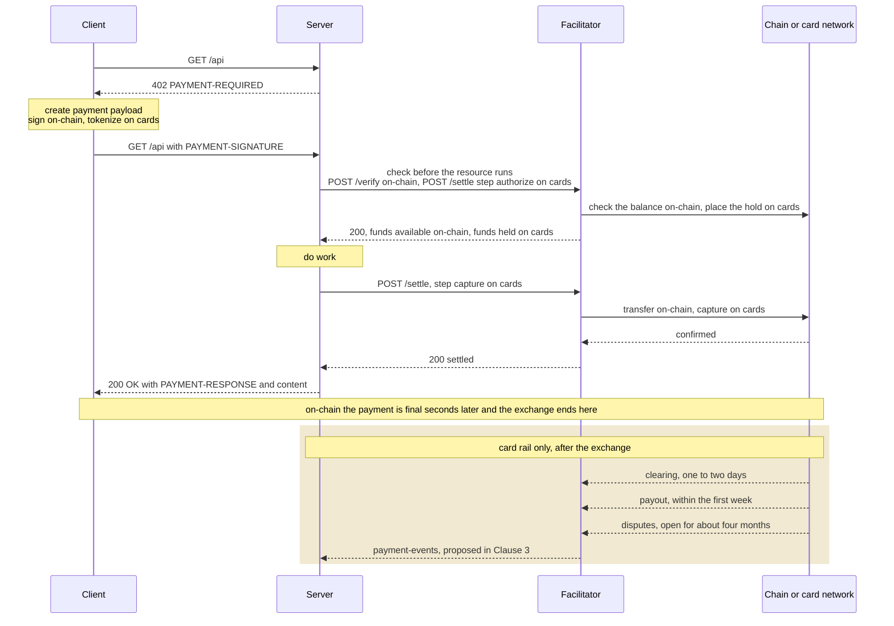
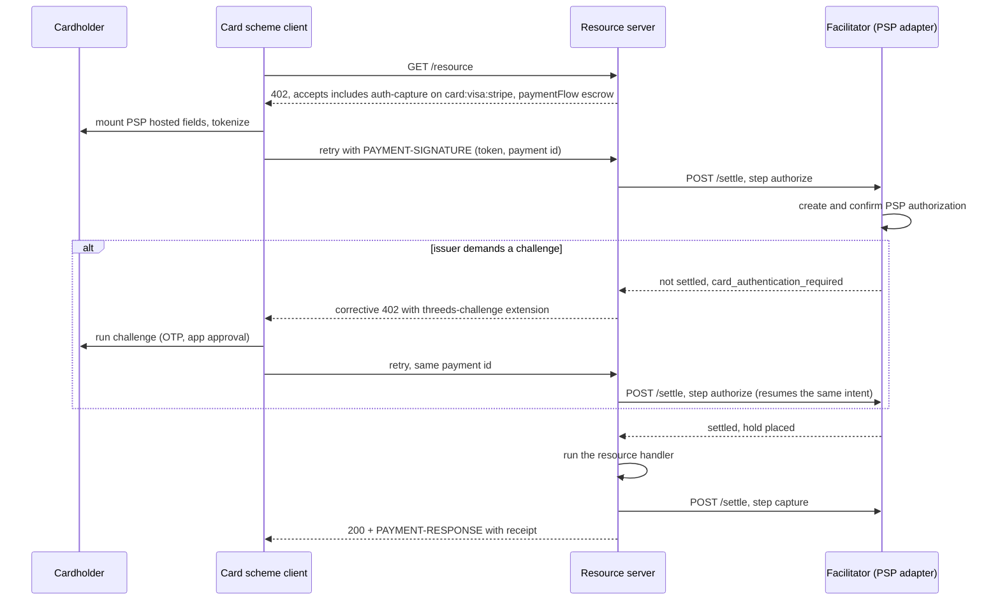

# [DRAFT] Card acceptance on `x402`

- **Status**: Draft
- **Version**: 0.1.0
- **Date**: 2026-08-08
- **Author**: Stefano Amorelli ([@stefanoamorelli](https://github.com/stefanoamorelli))
- **Contributors**:
- **Discussion**: `#wg-card-acceptance`

## Motivation

`x402` found its popularity through micro, on-chain transactions, although its potential is much bigger than that. The protocol is payment-method agnostic by construction, and this document proposes cards as its first non-crypto binding.

## Summary

Card acceptance builds on top of the existing architecture on `x402`. This proposal defines a card network binding for the `auth-capture` scheme under `card:<card-network>:<psp>` ids, a potential credit-backed `batch-settlement` binding for card micropayments, two extensions (`threeds-challenge` and `payment-events`), and the main SDK changes they need.

## 1 Scope

We cover the scheme binding, an high-level client and server integration, considerations about the post-settlement lifecycle, and security provisions specific to the card payment rail.

### 1.1 Scope decisions

Card payments involve more steps than the payment exchange, although those processes are not inherently part of the `x402` protocol. `Table 0` collects the decisions we take on what is in the scope of the protocol and what is not. Nevertheless, we provide context and notes on those areas to support integrations.

**Table 0. Scope decisions**

| Topic | Decision | Notes |
|---|---|---|
| PCI DSS | PCI DSS compliance is outside the scope of `x402`. Payloads should not carry the PAN, the CVC or track data. | Clause 8.1 covers the high-level implications for PCI DSS, and the considerations for facilitators. |
| 3DS | Challenge orchestration is the responsibility of the PSP and the issuer. `x402` defines how a challenge can interrupt the 402 loop, and how the retry resumes the same payment instead of initiating a new one. | The `threeds-challenge` extension, Clauses 4.4 and 7.2. |
| Post-settlement lifecycle | Clearing, payouts and disputes are within the scope of the card networks and the PSP. | The proposed `payment-events` channel carries their outcomes as events, Clause 3. |

## 2 Glossary

**PSP** payment service provider. The entity that tokenizes card data and executes authorizations, captures and refunds against the card networks (e.g. Stripe, Adyen)

**PAN** primary account number. The card number

**authorization** hold placed on the cardholder's available balance for a stated amount, valid for a limited period

**capture** transfer of previously authorized funds to the merchant

**3DS** EMV 3-D Secure; the card networks' cardholder authentication protocol, used to satisfy SCA (strong customer authentication) under PSD2

## 3 Payment lifecycle comparison between on-chain and card payments

At payment time the two rails run the same steps. The buyer produces a payment instrument (a signed transfer on-chain and a card token on cards), the facilitator checks it, the money moves, and the resource is delivered. `Figure 1` traces the exchange both rails share, and then the tail that only cards have, the main difference comes after delivery. An on-chain payment is final a few dozen seconds after settlement the funds cannot come back. A card payment, on the other hand, is still in flight when the HTTP exchange completes. The funds reach the merchant days later and the cardholder can dispute the charge for several months.



**Figure 1. The x402 exchange, identical on both rails, and the card-only tail that follows it.**

Card payments can be modeled on top of the existing abstraction of `auth-capture` scheme instead of getting a scheme of their own. `Table 1` maps each on-chain step onto its card equivalent.

**Table 1. On-chain and card equivalents per step**

| Step | On-chain, `exact` | Card, `auth-capture` |
|---|---|---|
| Create the payment instrument | sign the transfer with the wallet | turn the card into a token at the PSP |
| Check before the resource runs | `/verify`, check the signature and the balance | `/settle` at step `authorize`, place a hold, the issuer sets the money aside |
| Move the funds | `/settle`, execute the on-chain transfer | `/settle` at step `capture`, collect the money that was set aside |
| Deliver the resource | same on both rails | same on both rails |
| After delivery | amount reflected in seconds or mintues | money arrives in days but is disputable for months |

Cards payments might require step-up authentication. A card issuer can interrupt a payment and ask the cardholder to prove their identity, usually with SCA. This flow could be handled by a implementing a dedicated `threeds-challenge` extension that carries an extra round trip over the same `402` loop.

Each card payment should also carry an idempotency id (`payment-identifier`), so a retried request resumes the same payment instead of charging the card twice.

What happens after delivery remains outside of the scope of `x402`. Post-delivery is not currently implemented because of the irreversible nature of onchain transactions (that is the first case being supported on `x402`. With cards, however, the funds can "keep moving" for months after the initial exchange ends. The proposed `payment-events` channel could give the seller visibility over that tail with one event per milestone, such as: `payout.paid`, `refund.succeeded`, `dispute.opened`, and `settlement.finalized` when the payment can no longer be reversed.

The internals of how clearing, payouts and disputes are actually resolved stay with the card networks and the PSP contract, and outside the scope of this protocol. `x402` can just support carrying their outcomes as events.

## 4 Scheme binding

### 4.1 General

The card lifecycle (authorize, then capture or void, then refund) is the lifecycle the `auth-capture` scheme (TBD). Cards are therefore defined as a network binding for that scheme, in the same way `exact` has EVM bindings. By using the existing abstraction allows the selection, hooks and receipts continue to work as they do for the crypto schemes, and lets the application code stay unaware of which method paid.

### 4.2 Network identifiers

Network identifiers take the form `card:<card-network>:<psp>`, for example `card:visa:stripe` and `card:mastercard:adyen`. The last segment names the PSP because a tokenized payload is only redeemable at the PSP that minted the token. The middle segment names the card network. Interchange, surcharge rules and acceptance differ across networks. Declaring the network in the identifier lets a server offer, price and route each brand independently. A server that accepts several brands through one PSP lists one entry per brand. Wildcards compose per segment, so a client can register `card:*` for any card payment or `card:visa:*` for one brand across PSPs.

### 4.3 Payment flow and settlement

A card network offers no read-only way to test whether funds are available. The only reliable check is the authorization itself. An authorization commits state at the issuer and holds the cardholder's funds, so it cannot sit behind `/verify`, which is read-only.

Cards therefore bind to the `escrow` payment flow. The first `/settle` places the authorization before the resource runs, the resource executes, and the second `/settle` captures. `/verify` takes no part in the ordering. Since the resolved flow is not `authorization`, `accepts[].extra.paymentFlow` shall carry `escrow`, so that clients can reason about fund commitment before the handler runs.

The facilitator distinguishes the two settlement calls through a server-led `step` field, `authorize` for the hold and `capture` for the collection. Two constraints follow:
- Every settlement request shall carry a `payment-identifier` (`specs/extensions/payment_identifier.md`), so that a retried authorization resumes the existing PSP intent instead of opening a second hold; and
- most importantly, the facilitator shall void any authorization that does not reach capture, since an open authorization blocks the buyer's funds.

### 4.4 Step-up authentication

When an issuer requires 3DS authentication, the authorizing settlement fails, the resource server answers with a corrective 402 carrying a `threeds-challenge` extension, and the client completes the challenge and retries under the same payment identifier.

### 4.5 Micropayments

Since card transactions can notably be more expensive than on-chain transactions, per-transaction card payments are not viable at micropayment amounts. For that traffic we can use the model of `batch-settlement`. The buyer places one card on file during a single authenticated setup, signs a commitment per request, and receives one aggregated capture per billing cycle.

## 5 Client integration

### 5.1 Registration and selection

The application layer is unaffected by the addition of cards. Payment methods are scheme clients registered on the `x402Client`, so the calling code sees the same interface whichever rail ends up paying.

EXAMPLE 1 Registration of the card scheme next to existing crypto schemes:

```ts
const client = x402Client.fromConfig({
  schemes: [
    { network: "eip155:*", client: new ExactEvmScheme(evmSigner) },
    { network: "solana:*", client: new ExactSvmScheme(svmSigner) },
    { network: "card:*",   client: new CardScheme({ vault, ui }) },   // accepting card payments
  ],
});

const payFetch = wrapFetchWithPayment(fetch, client);

// Application code, identical whether a card or a chain pays:
const res = await payFetch("https://api.example.com/report");
```

Selection between rails is declarative, so by default the client takes the first entry the server offered that it supports. A custom selector, for example, may route small amounts on-chain and larger purchases to the card.

EXAMPLE 2 Amount-based routing between rails:

```ts
paymentRequirementsSelector: (v, reqs) =>
  usdCents(reqs[0]) < 50n
    ? reqs.find(isCrypto) ?? reqs[0]
    : reqs.find(isCard) ?? reqs[0],
```

### 5.2 Scheme client

`CardScheme` implements `SchemeNetworkClient` and registers under `card:*`.

EXAMPLE Core of the scheme client:

```ts
export class CardScheme implements SchemeNetworkClient {
  readonly scheme = "auth-capture";
  readonly schemeHooks: SchemeClientHooks;   // 3DS recovery hook

  constructor(private deps: { vault?: CardTokenVault; ui?: CardUiDelegate }) {}

  async createPaymentPayload(v: number, req: PaymentRequirements): Promise<PaymentPayloadResult> {
    // A 3DS challenge just completed. Rebuild the payload with its outcome.
    const challenged = this.state.takeChallengeOutcome(req);
    if (challenged) return this.payloadFrom(v, challenged);

    // Agent path. A vaulted credential resolves without UI in milliseconds
    // and behaves like a wallet signature.
    const vaulted = await this.deps.vault?.lookup(req);
    if (vaulted) return this.payloadFrom(v, vaulted);

    // First-time human. PSP hosted fields; the PAN goes browser -> PSP iframe,
    // the client receives an opaque single-use token.
    if (!this.deps.ui) throw new CardCheckoutUnavailable(req);
    const tok = await this.deps.ui.collectPaymentMethod(req);   // unbounded async is permitted here
    return { x402Version: v, payload: { token: tok.id, threeDs: tok.threeDs } };
  }
}
```

NOTE: `PAYMENT-SIGNATURE` is an HTTP header, and header values reach access logs and proxies. The prohibition on card data in payloads is specified in Clause 8.1.

### 5.3 Payment flow

Figure 2 shows the flow for a first-time payer, including the step-up branch.



**Figure 2. Card payment flow, including step-up authentication**

Most flows do not reach the challenge branch, because frictionless 3DS completes inside the PSP SDK during tokenization, in such cases the exchange completes in a single round trip like an onchain payment. When a challenge occurs, reusing the same `payment-identifier` lets the facilitator resume the same PSP intent instead of opening a second hold.

## 6 Server and facilitator

### 6.1 Route configuration

EXAMPLE Mixed route configuration:

```ts
accepts: [
  { scheme: "exact", network: "eip155:8453", payTo: PAY_TO_EVM, price: "$0.97", maxTimeoutSeconds: 60 },
  { scheme: "auth-capture", network: "card:visa:stripe", payTo: "acct_1Nxyz",
    price: "$1.00", maxTimeoutSeconds: 900,
    extra: { paymentFlow: "escrow", autoCapture: false } },
]
```

Configuration order is preserved into `accepts[]`, and the default client selector takes the first supported entry. It's worth mentioning that surcharging consumer cards can be prohibited depending on jurisdiction.

### 6.2 Facilitator requirements

The complexity of cards accpetance is mostly on the facilitator (by design). The client learns to tokenize, and the resource server is unchanged. The PSP integration (3DS orchestration, idempotency, webhook ingestion, dispute handling, payout reconciliation) is concentrated in the facilitator, which is where `x402` already places trust.

TBD

## 7 Card-specific considerations

### 7.1 Wallets

Apple Pay and Google Pay collapse tokenization and 3DS into one sheet, and issuers treat wallet payments as authenticated. Apple Pay requires the merchant domain to be registered with the PSP in advance, which the 402 response cannot carry, and the payment sheet opens only from a user gesture. Wallets are therefore cannot be supported by agentic flows and remain human-only.

### 7.2 Soft declines

An issuer in the EU can refuse an otherwise valid authorization and demand authentication under PSD2 SCA. This outcome can be considered common (not an edge-case), therefore this can be covered by an ad-hoc extension (`threeds-challenge`). 

### 7.3 Decline handling and retry limits

Card errors divide into soft declines (retriable with backoff), hard declines (not retriable) and step-up. Retry limits are card-network rules with fines attached, hence retry classes should belong in the binding specification rather than in application code.

TBD

## 8 Security considerations

### 8.1 Cardholder data and PCI DSS scope

Payloads shall not contain the PAN, the CVC or track data, the payload carries PSP tokens and references only. `PAYMENT-SIGNATURE` is an HTTP header, and hence can easily reach access logs, proxies and monitoring. A single leaked PAN would therefore contaminate every log pipeline on the path. Ideally facilitators should reject payloads containing Luhn-valid 13- to 19-digit strings as defense in depth.

PCI DSS scope follows the data flow. Table 2 lists the resulting posture per party.

**Table 2. PCI DSS scope and 3DS role per party**

| Party | Card data seen | PCI DSS posture | 3DS role |
|---|---|---|---|
| Resource server | none, only tokens (and receipts) | SAQ A | none |
| x402 client library | none, tokens only | outside the CDE | none, the PSP SDK runs the challenge UI |
| Facilitator | tokens and charge ids | outside cardholder-data scope while token-only, a facilitator that proxies PANs becomes a PCI service provider requiring a full assessment | 3DS requestor, through the PSP |
| PSP | PAN | Level 1 service provider | 3DS server |
| Issuer ACS | PAN and authentication data | issuer side | challenge authority |

### 8.2 Abuse resistance

For onchain transactions the `/verify` check doesn't cost anything, but with cards, the check before the resource runs reaches a real issuer and can count against the merchant's fraud ratios (the authorizing settlement also holds the buyer's funds in card transactions). The facilitator shall rate-limit authorization by card fingerprint and IP, shall collapse hard-decline detail into one opaque code, and shall treat tokens as strictly single-use.
