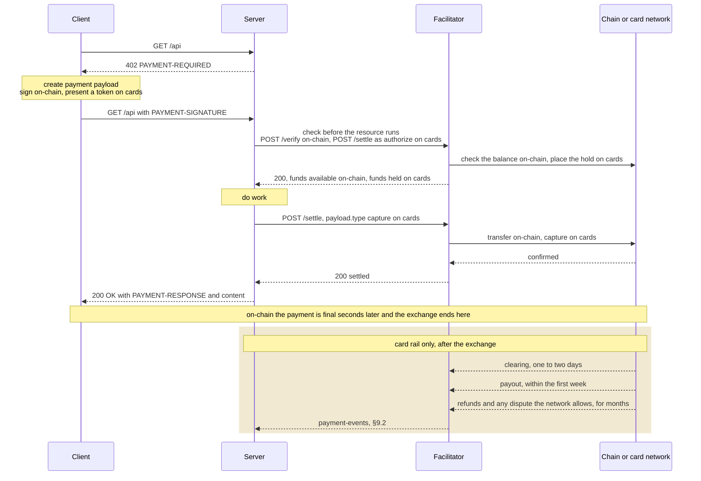
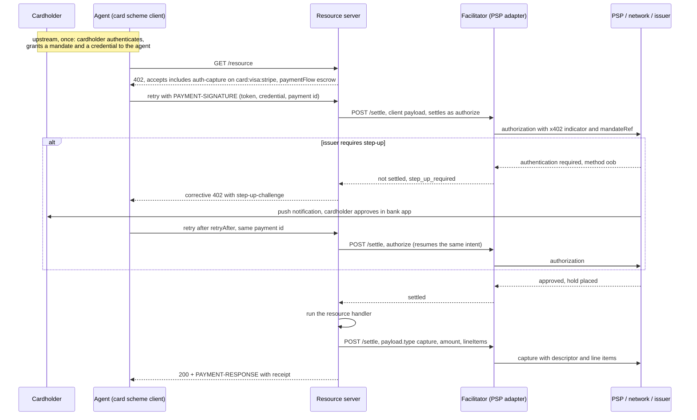

# [DRAFT] Card acceptance on `x402`

- **Status**: Draft
- **Version**: 0.1.0
- **Date**: 2026-08-08
- **Author(s)**: Stefano Amorelli ([@stefanoamorelli](https://github.com/stefanoamorelli))
- **Contributor(s)**: Erik Reppel ([@erikreppel](https://github.com/erikreppel)), Steve Kaliski (Stripe, [@sjkaliski](https://github.com/sjkaliski)), Carson Roscoe (Coinbase, [@CarsonRoscoe](https://github.com/CarsonRoscoe)), Adam Krochak (American Express)
- **Discussion**: `#wg-card-acceptance`

## Motivation

`x402` found its popularity through micro, on-chain transactions, although its potential is much bigger than that. The protocol is payment-method agnostic by construction, and this document proposes cards as its first non-crypto binding.

## Summary

Card acceptance builds on top of the existing architecture of `x402`. This document defines a card network binding for the `auth-capture` scheme under `card:<card-network>:<psp>` identifiers, a card binding for `batch-settlement` for micropayments, two extensions (`step-up-challenge` and `payment-events`), and the SDK changes they need.


It also names what the binding depends on but does not define. Those are the delegation of spending authority from a cardholder to an agent, and the network policy that governs a card transaction once it leaves the `x402` exchange. A valid card token may be sufficient on its own, or the upstream trust layer, the PSP, the card network and the issuer, may require evidence of that delegation on top of it. The binding carries what they need to decide (§1.1 and §4.5).

## 1 Scope

We cover the scheme binding, the payload and settlement contract between client, resource server and facilitator, a high-level client and server integration, sub-minor-unit accounting for metered usage, statement metadata, decline handling, the two extensions, and security provisions specific to the card rail.

### 1.1 Scope decisions

Card payments involve more steps than the payment exchange, although those processes are not inherently part of the `x402` protocol. `Table 0` states, per topic, what stays out of the scope of `x402` and what this binding takes in scope. Nevertheless, we provide context and notes on those areas to support integrations.

**Table 0. Scope decisions**

| Topic | Out of scope of `x402` | In scope of this binding | Notes |
|---|---|---|---|
| PCI DSS | PCI DSS compliance of the parties. | The prohibition on card data on the wire. Payloads shall not carry the PAN, the CVC or track data. | §8.1 covers the high-level implications for PCI DSS, and the considerations for facilitators. |
| Delegated authority | The mandate itself. How a cardholder authorizes an agent to spend within stated constraints (a mandate, or "intent") is established upstream of `x402`, in the issuer, network and PSP agentic frameworks, for example Amex Agentic Commerce Experiences (ACE), Visa Intelligent Commerce and Mastercard Agent Pay. | The credential provenance and, when the PSP, the network or the issuer requires it, a mandate reference on the payload, so that they can decide whether the token alone is sufficient for this payment. | §4.5. Whether a credential stored for the cardholder's own purchases may also be used by an agent is decided by the PSP that vaulted it and by the issuer. |
| Credential issuance | Which token the agent holds and how it was provisioned, decided by the network, the wallet or the PSP. | The token, carried opaque. | §4.5 and §7.1. |
| Cardholder authentication | Authentication (SCA, 3DS, bank-app approval), which belongs at delegation time and is the issuer's. Challenge orchestration during a payment, which is the PSP's and the issuer's. | How a challenge can interrupt the 402 loop, and how the retry resumes the same payment instead of initiating a new one. | The `step-up-challenge` extension, §4.6, §7.2 and §9.1. |
| Network policy | Pricing, risk checks, settlement method, and whether and how a charge can be disputed, defined by the card networks for `x402` transactions. | An `x402` indicator on every authorization. | §4.9. Outcomes may be surfaced as events through the optional `payment-events` extension, §9.2. |
| Post-settlement lifecycle | Clearing, payouts, refunds and disputes, which stay with the card networks and the PSP contract. | Nothing in the payment exchange. The optional `payment-events` extension may carry their outcomes as events. | §3 and §9.2. |
| Merchant onboarding | KYC and the payout schedule, matters of the PSP contract. | Nothing. | |

The processes in `Table 0` are handled by their owners outside `x402`. Whether a token can be used as it is, or needs a mandate behind it, is decided upstream of `x402` by the trust layer. The trust layer is the PSP for a vaulted token, the card network for an agentic token, and in both cases the issuer, which ultimately approves the authorization. `x402` does not make that decision, but it carries the credential provenance and the mandate reference so that the trust layer can decide (§4.5).

## 2 Glossary

**PSP** payment service provider. The entity that tokenizes card data and executes authorizations, captures and refunds against the card networks (e.g. Stripe, Adyen)

**PAN** primary account number. The card number

**authorization** hold placed on the cardholder's available balance for a stated amount, valid for a limited period

**capture** transfer of previously authorized funds to the merchant

**mandate** standing authorization a cardholder gives an agent to spend within stated constraints (amount, period, merchant category, purpose). Established in a delegation framework upstream of `x402`, referenced but not defined here

**agentic token** card token provisioned downstream of a mandate, scoped to the agent that holds it

**card-on-file** credential stored at a PSP with the cardholder's consent for later use by the same merchant

**step-up** issuer-requested cardholder authentication during a payment. 3DS, bank-app approval after a push notification, one-time codes are examples of authentication methods

**3DS** EMV 3-D Secure. the card networks' cardholder authentication protocol, used to satisfy SCA (strong customer authentication) under PSD2

**minor unit** smallest unit a card network authorizes in, for example the cent for USD (ISO 4217 exponent)

## 3 Payment lifecycle comparison between on-chain and card payments

At payment time the two rails run the same steps. The buyer produces a payment instrument (a signed transfer on-chain, a card token on cards), the facilitator checks it, the money moves, and the resource is delivered. `Figure 1` traces the exchange both rails share, then the tail that only cards have. An on-chain payment is final a few dozen seconds after settlement and the funds cannot come back. A card payment, on the other hand, is not fully completed when the HTTP exchange completes. The funds reach the merchant days later, and refunds, payouts and disputes can keep moving the funds for months afterwards. The process after the HTTP cycle is completed is outside the scope of `x402` (§1.1).



**Figure 1. The x402 exchange, identical on both rails, and the card-only tail that follows it. The tail may be surfaced through `payment-events` and it is not part of the exchange.**

Card payments can be modeled on top of the existing `auth-capture` scheme instead of getting a scheme of their own. `Table 1` maps each on-chain step onto its card equivalent.

**Table 1. On-chain and card equivalents per step**

| Step | On-chain, `exact` | Card, `auth-capture` |
|---|---|---|
| Create the payment instrument | sign the transfer with the wallet | present a PSP token (§4.5) |
| Check before the resource runs | `/verify`, check the signature and the balance | `/settle` as `authorize`, place a hold, the issuer sets the money aside |
| Move the funds | `/settle`, execute the on-chain transfer | `/settle` with `payload.type` `capture`, collect the money that was set aside |
| Deliver the resource | same on both rails | same on both rails |
| After delivery | amount reflected in seconds or minutes | money arrives in days and can keep moving for months (refunds, payouts, any dispute the network allows), out of scope |

Card payments might require step-up authentication. An issuer can interrupt a payment and ask the cardholder to prove their identity. §4.6 handles this with the `step-up-challenge` extension, which adds a round trip over the same `402` loop, and states why that round trip should be the exception.

Each card payment shall carry an idempotency id (`payment-identifier`), so a retried request resumes the same payment instead of charging the card twice.

What happens after delivery remains outside of the scope of `x402`. Post-delivery is not currently implemented because of the irreversible nature of on-chain transactions, the first case supported on `x402`. With cards, however, the funds can "keep moving" for months after the initial exchange ends, through refunds, payouts, and whatever dispute treatment the network defines for this transaction type. Those events may be captured using the proposed `payment-events` extension (§9.2), which could give the seller visibility over that tail with one event per milestone, such as `payout.paid`, `refund.succeeded`, `dispute.opened`, and `settlement.finalized` when the payment can no longer be reversed. Whether a charge for a digital good already consumed by a machine can be disputed at all, and how, is for the card networks to decide. The extension may carry that outcome as an event if a network defines one, and assumes nothing about it otherwise.

The internals of how clearing, payouts and disputes are actually resolved stay with the card networks and the PSP contract, and outside the scope of this protocol. `x402` may just support carrying their outcomes as events.

## 4 Scheme binding

### 4.1 General

The card lifecycle (authorize, then capture or void, then refund) is the lifecycle of the `auth-capture` scheme. Cards are therefore defined as a network binding for that scheme, in the same way `exact` has EVM bindings. Using the existing abstraction lets selection, hooks and receipts continue to work as they do for the crypto schemes, and lets the application code stay unaware of which method paid. `Table 4` in §4.10 maps the network requirements of the parent scheme onto the sections of this binding.

### 4.2 Network identifiers

Network identifiers take the form `card:<card-network>:<psp>`, for example `card:visa:stripe` and `card:mastercard:adyen`. The last segment names the PSP because a tokenized payload is only redeemable at the PSP that minted the token. The middle segment names the card network. Interchange, surcharge rules and acceptance differ across networks. Declaring the network in the identifier lets a server offer, price and route each brand independently. A server that accepts several brands through one PSP lists one entry per brand. Wildcards compose per segment, so a client can register `card:*` for any card payment or `card:visa:*` for one brand across PSPs.

The third segment is a sub-reference, which the core specification permits on top of the CAIP-2 form. Identifiers without a sub-reference remain valid CAIP-2.

### 4.3 Payment flow and settlement

A card network offers no read-only way to test whether funds are available. The only reliable check is the authorization itself. An authorization commits state at the issuer and holds the cardholder's funds, so it cannot sit behind `/verify`, which is read-only.

Cards therefore bind to the `escrow` payment flow, the default of the parent scheme. The first `/settle` carries the client payload and settles as `authorize`, placing the hold before the resource runs. The resource executes. The second `/settle` carries a lifecycle payload with `payload.type` `capture`, or `void` when the resource produced nothing to charge for. `/verify` takes no part in the ordering. `accepts[].extra.paymentFlow` shall carry `escrow`, so that clients can reason about fund commitment before the handler runs. The `authorization` flow of the parent scheme, which relies on `/verify` before the resource and a `charge` after it, is not offered on cards, because the pre-resource check it relies on does not exist.

`extra.captureMode` keeps the meaning the EVM binding gives it. Under `sync`, the default, the in-request `/settle` after the handler captures the final amount and releases the remainder of the hold. Under `deferred`, the resource server captures later from durable state, and the facilitator relays that later `capture` in the same way. A resource server that publishes `deferred` shall retain the `payment-identifier` `id` and the authorized amount until it captures or voids.

`extra.captureDeadline` and `extra.refundDeadline` may be advertised. When they are absent, the PSP's authorization validity and refund window apply, and the facilitator returns the effective values in `SettleResponse.extra`. Three constraints follow:

- every settlement request shall carry a `payment-identifier` `id`, so that a retried authorization resumes the existing PSP intent instead of opening a second hold;
- the facilitator shall void any authorization it will not capture, and at the latest at `captureDeadline`, since an open authorization blocks the buyer's funds. A hold the facilitator never touches lapses at the issuer when the authorization expires. That lapse is the card equivalent of `reclaim`, and it needs no action from the client; and
- the capture amount shall not exceed the authorized amount. Where usage is metered, the resource server passes the final amount in the `amount` field of the `capture` payload, and the facilitator captures that amount.

`SettleResponse.transaction` carries the PSP's charge or intent identifier, `network` carries the `card:<card-network>:<psp>` identifier, and `amount` carries the amount held or captured in minor units. A PSP that acknowledges a capture without confirming it is reported as `settlement_pending`, with the PSP identifier in `transaction`, as the core specification defines for a broadcast whose confirmation could not be established.

### 4.4 Lifecycle payloads and server consent

`capture`, `void` and `refund` have no client payload to build on. The resource server authors them and passes them to `POST /settle` with `payload.type` naming the operation, as the parent scheme requires. On cards the payment is identified by its `payment-identifier` `id`, so the lifecycle payload carries that id and nothing the facilitator has to reconstruct.

EXAMPLE Capture payload for a metered resource:

```json
{
  "x402Version": 2,
  "accepted": { "scheme": "auth-capture", "network": "card:visa:stripe", "...": "..." },
  "payload": {
    "type": "capture",
    "paymentId": "pay_7d5d747be160e280504c099d984bcfe0",
    "amount": "73",
    "lineItems": [
      { "description": "report generation", "quantity": "1", "unit": "report", "amount": "73", "resource": "https://api.example.com/report" }
    ]
  }
}
```

**Table 2. Lifecycle payload fields**

| Field | Required | Description |
|---|---|---|
| `type` | yes | `capture`, `void` or `refund` |
| `paymentId` | yes | the `payment-identifier` `id` of the payment the operation applies to |
| `amount` | for `capture` and `refund` | amount in minor units. A `capture` amount shall not exceed the authorized amount, a `refund` amount shall not exceed the captured amount not yet refunded |
| `lineItems` | no | consumption metadata forwarded to the PSP (§4.8) |

The parent scheme requires the binding to authenticate that facilitator-relayed lifecycle operations are consented to by the resource server. On cards there is no on-chain signature to check, so consent is the authenticated identity of the resource server on the settle request. The facilitator shall authenticate every lifecycle settle against the resource server registered as `payTo` for that payment, through the credential it issued at onboarding or an HTTP message signature (RFC 9421) under a key registered there, and shall refuse a lifecycle payload for a `paymentId` that belongs to a different resource server. The facilitator shall accept each `capture` and `refund` at most once per `paymentId` and idempotency key, so that a retried request is answered from the stored outcome instead of being submitted again.

`refund` may also run out of band, through the PSP's own interface, without a lifecycle settle. A facilitator that relays only the collect settle shall say so on `/supported`, and a resource server on such a facilitator shall publish `captureMode: "deferred"`.

### 4.5 Credential provenance and delegated authority

The payload names the token and says where the token comes from. The facilitator uses the provenance to decide which checks apply, and the PSP uses it to decide whether the token may be used at all.

EXAMPLE Payload for an agent-initiated payment:

```json
{
  "x402Version": 2,
  "scheme": "auth-capture",
  "network": "card:visa:stripe",
  "payload": {
    "token": "pm_1Nxyz",
    "credential": {
      "kind": "agentic-token",
      "initiator": "agent",
      "mandateRef": "mnd_8f3a2c1d"
    }
  },
  "extensions": {
    "payment-identifier": {
      "info": { "required": true, "id": "pay_7d5d747be160e280504c099d984bcfe0" }
    }
  }
}
```

**Table 3. `payload.credential` fields**

| Field | Required | Values | Meaning |
|---|---|---|---|
| `kind` | yes | `single-use` | token minted by PSP hosted fields from a card the cardholder just entered, cardholder present |
| | | `card-on-file` | credential stored at the PSP with a stored mandate |
| | | `agentic-token` | credential provisioned downstream of a delegation framework, scoped to the agent (network agentic tokens, wallet-issued agentic tokens) |
| `initiator` | yes | `cardholder`, `agent` | who is making this payment |
| `mandateRef` | when the PSP, the network or the issuer requires it for an agent-initiated payment | opaque string, 16 to 128 characters | reference the PSP or network resolves to the mandate, its contents are outside `x402` |
| `stepUp` | no | object | outcome of a completed challenge (§9.1), present only on a retry after step-up |

The facilitator submits the authorization with the provenance and, when present, the `mandateRef`. It does not decide on authority itself. The PSP, the network and the issuer do, per token, use case and amount:

- a valid token may be accepted on its own. Where the PSP, the network or the issuer requires evidence of delegated authority for this payment and the payload carries none, the authorization is declined with `authority_required`, and the client may retry under the same `payment-identifier` with a `mandateRef` obtained through the delegation framework;
- `initiator: agent` with `kind: single-use` is submitted as is. A hosted-fields token is a cardholder-present artifact and carries no delegation of its own, so whether an agent may use it is entirely the PSP's decision;
- `initiator: agent` with `kind: card-on-file` is submitted with the `mandateRef` when there is one. The PSP decides whether the stored credential, and its mandate where one exists, cover agent use;
- `initiator: agent` with `kind: agentic-token` is submitted with the `mandateRef`. The network or issuer validates the mandate scope (amount, period, merchant, purpose) as part of authorization.

The facilitator forwards `mandateRef`. Whether a token alone is sufficient, and when evidence of delegated authority is required on top of it, is decided by the PSP, the network and the issuer. The binding carries that evidence when it is required. The authority itself and how it was granted and how it is validated, belongs to the PSP, network and issuer frameworks in `Table 0`.

### 4.6 Step-up authentication

An issuer may condition an authorization on cardholder authentication. When it does, the authorizing settlement fails with `step_up_required`, the resource server answers with a corrective `402` carrying the `step-up-challenge` extension (§9.1), and the client completes the challenge and retries under the same `payment-identifier`.

The binding does not name a method. The extension carries the method the issuer chose. That can be 3DS where the market requires it, bank-app approval after a push notification, a one-time code, or a hosted redirect. In markets where 3DS is not mandated, the issuer picks.

Authentication should happen when the cardholder delegates, not in the middle of an `x402` exchange. A challenge raised while an agent executes forces a user who may be offline to intervene. The intended model is that the cardholder authenticates once, at the time they grant the mandate and the credential to the agent, and the agent then spends within the mandate without further prompts. For `kind: single-use`, frictionless 3DS runs inside the PSP SDK during tokenization and the exchange completes in a single round trip. For `agentic-token` and `card-on-file`, the authentication already happened at delegation.

When a challenge is nonetheless raised on an `initiator: agent` payment:

- if the issuer offers an out-of-band method (`oob`), the client retries the same payment after `retryAfter` seconds until `expiresAt`, while the issuer reaches the cardholder on a channel it owns;
- otherwise the facilitator fails the authorization with `authority_required` and the client surfaces the outcome to its principal through the delegation framework, which may re-establish the mandate with a fresh authentication. The client does not attempt to render a challenge it cannot complete.

### 4.7 Micropayments and sub-minor-unit accounting

Per-transaction card fees make per-request authorization unviable at micropayment amounts. For that traffic the binding uses the model of `batch-settlement` on the same `card:<card-network>:<psp>` network. The buyer establishes a mandate and a credential once, signs a commitment per request, and receives one aggregated capture per billing cycle.

Card networks authorize in whole minor units. Metered resources price below that. The binding resolves the mismatch with a facilitator ledger:

- `accepts[].amount` stays in minor units, as the parent scheme requires, and is the per-request ceiling;
- `accepts[].extra.unitAmount` is a decimal string in minor units with up to `ledgerScale` fractional digits (default 6), for example `"0.037"`;
- the actual per-request charge is returned in `PAYMENT-RESPONSE.amount` at the same scale;
- the facilitator keeps one ledger per mandate at `ledgerScale` precision and adds each accepted commitment to it;
- at cycle end the facilitator captures `floor(balance)` minor units and carries the fractional remainder to the next cycle. The network only ever sees whole minor units;
- the facilitator stops accepting commitments when the balance reaches the mandate's cycle ceiling;
- if the balance is below the PSP's minimum capture amount at cycle end, it carries over;
- when the mandate ends, any balance below one minor unit (or below the PSP minimum) is written off by the seller. The remainder is never rounded up against the cardholder.

Rounding and carry-over are the facilitator's job, as owner of the commitment store, not the merchant's and not the PSP's. The `batch-settlement` network requirements (commitment format, verification rules, storage behavior, double-spend prevention, commitment expiry, redemption, trust model) are satisfied as follows. The commitment is an HTTP message signature (RFC 9421) over the request under a key registered at mandate setup. Verification checks the signature, the mandate's remaining headroom and the `payment-identifier`. The ledger is the storage and the commitment identifier is the ledger entry id. The `payment-identifier` prevents double acceptance. Commitments expire with the mandate. Redemption is the cycle-end capture. The trust model is credit-backed against the mandate's authorized credential.

### 4.8 Statement descriptor and consumption metadata

A card statement line reading "Cloudflare $27.13" tells the cardholder nothing about what was consumed. Issuers want the resource and the usage in front of servicing agents and on statements, which lowers confusion, first-party fraud and disputes. The binding carries it in two places:

- `accepts[].extra.descriptor`, a merchant-chosen string identifying the resource, at most 22 characters (the networks' dynamic descriptor limit), forwarded by the facilitator as the dynamic statement descriptor suffix;
- `payload.lineItems` on the `capture` payload (and on each cycle-end capture under §4.7), an array of `{ description, quantity, unit, amount, resource }`, where `resource` is the resource URL. The facilitator forwards line items to the PSP as Level 2/3 data where the network supports it, and as the descriptor otherwise.

Line items describe the resource, not the content. They carry no payload of the response, and no personal data of the buyer beyond what the mandate already carries.

### 4.9 Network identification of `x402` transactions

Every authorization submitted under this binding shall be identified to the network as an `x402` transaction, so that the network and the issuer can apply the policy, risk checks, pricing and settlement method they define for it. The identifier travels either as a transaction-level indicator in the authorization message or through a merchant configuration reserved for `x402` traffic. Which of the two a given PSP and network pair uses is their integration choice, and the facilitator supports whichever the PSP exposes. The identifier is required by this binding.

### 4.10 Network requirements of the parent scheme

The `auth-capture` scheme lists eight things every network binding shall specify. `Table 4` gives where this binding does so.

**Table 4. Parent scheme requirements and where the card binding meets them**

| Requirement | Card binding |
|---|---|
| Hold and settlement mechanism | PSP authorization, capture, void and refund against the card network; deadlines are the PSP's authorization validity and refund window unless advertised (§4.3) |
| Client authorization format | a PSP token with its provenance (§4.5); the payment's identity is the `payment-identifier` `id` (§4.3) |
| Operator model | the facilitator, through its PSP account, drives every operation; the resource server initiates `capture`, `void` and `refund` (§4.4) |
| Server consent | authenticated identity of the resource server on each lifecycle settle (§4.4) |
| Replay protection | one accepted `capture` or `refund` per `paymentId` and idempotency key; `single-use` tokens are consumed on first use (§4.4 and §8.2) |
| Per-operation verification and settlement | provenance forwarding (§4.5), amount ceilings and PSP calls (§4.3 and §4.4), decline classes (§7.3) |
| Refund funding | the merchant's PSP balance; the facilitator never funds a refund (§4.4) |
| Sync capture-and-void | a single `capture` for the final amount releases the remainder of the hold at the PSP (§4.3) |

## 5 Client integration

### 5.1 Registration and selection

The application layer is unaffected by the addition of cards. Payment methods are scheme clients registered on the `x402Client`, so the calling code sees the same interface whichever rail ends up paying.

EXAMPLE 1 Registration of the card scheme next to existing crypto schemes:

```ts
const client = x402Client.fromConfig({
  schemes: [
    { network: "eip155:*", client: new ExactEvmScheme(evmSigner) },
    { network: "solana:*", client: new ExactSvmScheme(svmSigner) },
    { network: "card:*",   client: new CardScheme({ mandate, ui }) },
  ],
});

const payFetch = wrapFetchWithPayment(fetch, client);

// Application code, identical whether a card or a chain pays:
const res = await payFetch("https://api.example.com/report");
```

Selection between rails is declarative, so by default the client takes the first entry the server offered that it supports. A custom selector, for example, may route small amounts on-chain and larger purchases to the card.

EXAMPLE 2 Amount-based routing between rails:

```ts
paymentRequirementsSelector: (v, reqs) =>
  usdCents(reqs[0]) < 50n
    ? reqs.find(isCrypto) ?? reqs[0]
    : reqs.find(isCard) ?? reqs[0],
```

### 5.2 Scheme client

`CardScheme` implements `SchemeNetworkClient` and registers under `card:*`. It takes a `mandate` provider for agent-initiated payments and a `ui` delegate for cardholder-present ones. Either may be absent.

EXAMPLE Core of the scheme client:

```ts
export class CardScheme implements SchemeNetworkClient {
  readonly scheme = "auth-capture";
  readonly schemeHooks: SchemeClientHooks;   // step-up recovery hook

  constructor(private deps: { mandate?: MandateProvider; ui?: CardUiDelegate }) {}

  async createPaymentPayload(v: number, req: PaymentRequirements): Promise<PaymentPayloadResult> {
    // A step-up challenge just completed. Rebuild the payload with its outcome.
    const challenged = this.state.takeChallengeOutcome(req);
    if (challenged) return this.payloadFrom(v, challenged);

    // Agent path. The credential comes from a mandate the cardholder granted
    // upstream; the payload carries the token and the mandate reference.
    const granted = await this.deps.mandate?.credentialFor(req);
    if (granted) {
      return this.payloadFrom(v, {
        token: granted.token,
        credential: { kind: granted.kind, initiator: "agent", mandateRef: granted.mandateRef },
      });
    }

    // Cardholder present. PSP hosted fields; the PAN goes browser -> PSP iframe,
    // the client receives an opaque single-use token.
    if (!this.deps.ui) throw new CardCheckoutUnavailable(req);
    const tok = await this.deps.ui.collectPaymentMethod(req);   // unbounded async is permitted here
    return this.payloadFrom(v, {
      token: tok.id,
      credential: { kind: "single-use", initiator: "cardholder", stepUp: tok.stepUp },
    });
  }
}
```

NOTE: `PAYMENT-SIGNATURE` is an HTTP header, and header values reach access logs and proxies. The prohibition on card data in payloads is specified in §8.1.

### 5.3 Payment flow

`Figure 2` shows the agent-initiated flow, which most `x402` traffic is, with the step-up branch.



**Figure 2. Agent-initiated card payment, including out-of-band step-up**

For a cardholder-present first-time payer, the agent is replaced by a browser client that mounts PSP hosted fields, and frictionless 3DS completes inside the PSP SDK during tokenization. In both cases most flows do not reach the challenge branch. When one occurs, reusing the same `payment-identifier` lets the facilitator resume the same PSP intent instead of opening a second hold.

## 6 Server and facilitator

### 6.1 Route configuration

EXAMPLE Mixed route configuration:

```ts
accepts: [
  { scheme: "exact", network: "eip155:8453", payTo: PAY_TO_EVM, price: "$0.97", maxTimeoutSeconds: 60 },
  { scheme: "auth-capture", network: "card:visa:stripe", payTo: "acct_1Nxyz",
    price: "$1.00", maxTimeoutSeconds: 900,
    extra: { paymentFlow: "escrow", descriptor: "EXAMPLE API REPORT" } },
]
```

Configuration order is preserved into `accepts[]`, and the default client selector takes the first supported entry. Surcharging consumer cards can be prohibited depending on jurisdiction.

### 6.2 Facilitator requirements

The complexity of card acceptance is mostly on the facilitator (by design). The client learns to tokenize, and the resource server is unchanged. The PSP integration (step-up orchestration, idempotency, webhook ingestion, dispute handling, payout reconciliation) is concentrated in the facilitator, which is where `x402` already places trust.

A facilitator for a `card:<card-network>:<psp>` network:

- shall authenticate the resource server on every lifecycle settle and bind lifecycle payloads to the payment's `payTo` (§4.4);
- shall forward the credential provenance and, when present, the `mandateRef` with every authorization (§4.5);
- shall void any authorization it will not capture (§4.3);
- shall identify each authorization to the network as an `x402` transaction and forward `mandateRef`, the descriptor and the line items (§4.5, §4.8 and §4.9);
- shall rate-limit authorizations and collapse hard-decline detail (§8.2); and
- shall list on `/supported` which lifecycle operations it relays and whether `payment-events` is available.

### 6.3 Error codes

In addition to the protocol codes of the core specification, this binding defines:

- **`authority_required`**: the PSP, the network or the issuer requires evidence of delegated authority for this payment and the payload carries none, the mandate does not cover this use, or a challenge cannot be completed by the agent (§4.5 and §4.6)
- **`step_up_required`**: the issuer requires cardholder authentication; the corrective `402` carries `step-up-challenge` (§9.1)
- **`card_declined`**: the issuer refused the authorization; the facilitator returns this single code for every hard decline (§7.3 and §8.2)

## 7 Card-specific considerations

### 7.1 Wallets

Apple Pay and Google Pay collapse tokenization and authentication into one sheet when the cardholder is present. The sheet needs a user gesture and a merchant domain registered with the PSP in advance, which the `402` response cannot carry. That path is cardholder-present by construction and produces a `kind: single-use` credential.

Wallets also support the agentic model. When the user is present, the wallet authenticates them and hands the agent a device or agentic token (a DPAN or its agentic equivalent) together with a standing mandate. The agent uses that token later under `kind: agentic-token`, `initiator: agent`. Nothing in this binding is wallet-specific. The credential provenance and mandate reference of §4.5 are the same whether the network, the PSP or a wallet provisioned the token.

### 7.2 Soft declines

An issuer in the EU can refuse an otherwise valid authorization and demand authentication under PSD2 SCA. This outcome is common, not an edge case, and it is what `step-up-challenge` exists for. Outside the EU the same signal arrives as an issuer-chosen method. The extension is method-agnostic for that reason.

### 7.3 Decline handling and retry limits

Card errors divide into soft declines (retriable with backoff), hard declines (not retriable) and step-up. Retry limits are card-network rules with fines attached, hence retry classes belong in the binding specification rather than in application code. The facilitator shall not resubmit a hard-declined authorization for the same `payment-identifier`, and shall cap soft-decline retries per payment at the lower of the PSP's limit and the network's rule for the transaction type.

## 8 Security considerations

### 8.1 Cardholder data and PCI DSS scope

Payloads shall not contain the PAN, the CVC or track data; the payload carries PSP tokens and references only. `PAYMENT-SIGNATURE` is an HTTP header, and hence can easily reach access logs, proxies and monitoring. A single leaked PAN would contaminate every log pipeline on the path. Facilitators should reject payloads containing Luhn-valid 13- to 19-digit strings as defense in depth.

PCI DSS scope follows the data flow. `Table 5` lists the resulting posture per party.

**Table 5. PCI DSS scope and authentication role per party**

| Party | Card data seen | PCI DSS posture | Step-up role |
|---|---|---|---|
| Resource server | none, only tokens (and receipts) | SAQ A | none |
| x402 client library | none, tokens only | outside the CDE | none for agents; the PSP SDK runs the challenge UI for cardholder-present flows |
| Facilitator | tokens and charge ids | outside cardholder-data scope while token-only; a facilitator that proxies PANs becomes a PCI service provider requiring a full assessment | 3DS requestor, through the PSP |
| PSP | PAN | Level 1 service provider | 3DS server |
| Issuer ACS | PAN and authentication data | issuer side | challenge authority |

### 8.2 Abuse resistance

For on-chain transactions the `/verify` check costs nothing, but with cards the check before the resource runs reaches a real issuer and counts against the merchant's fraud ratios (the authorizing settlement also holds the buyer's funds). The facilitator shall rate-limit authorization by card fingerprint and IP, shall collapse hard-decline detail into one opaque code, and shall treat `single-use` tokens as strictly single-use.

### 8.3 Mandate scope

A `mandateRef` is a bearer reference. The facilitator shall bind it to the credential it arrived with and reject a payload that presents a known `mandateRef` with a different token. Mandate scope (amount, period, merchant, purpose) is enforced by the PSP, network or issuer that issued it. The facilitator does not widen a mandate, and the resource server never sees it.

## 9 Extensions

### 9.1 `step-up-challenge`

Carried by the resource server in the corrective `402` after an authorizing settlement fails with `step_up_required`.

```json
{
  "extensions": {
    "step-up-challenge": {
      "info": {
        "paymentId": "pay_7d5d747be160e280504c099d984bcfe0",
        "method": "oob",
        "expiresAt": 1756459200,
        "retryAfter": 5,
        "challenge": {}
      }
    }
  }
}
```

**Table 6. `step-up-challenge` fields**

| Field | Required | Description |
|---|---|---|
| `paymentId` | yes | the `payment-identifier` `id` the client shall reuse on retry |
| `method` | yes | `3ds`, `oob`, `otp`, `redirect` |
| `expiresAt` | yes | Unix seconds after which the challenge, and the authorization attempt, lapse |
| `retryAfter` | when `method` is `oob` | seconds the client waits before retrying the same payment |
| `challenge` | method-specific | `3ds`: PSP client secret for the SDK; `otp`: delivery hint; `redirect`: hosted URL; `oob`: empty |

The client answers by retrying with the same `payment-identifier` and, for `3ds`, `otp` and `redirect`, with `payload.credential.stepUp` set to the outcome the PSP SDK or hosted page returned.

### 9.2 `payment-events`

An optional facilitator-to-resource-server channel for the card tail of `Figure 1`. A resource server that wants it advertises it in the `402`. The facilitator may then deliver events to `callbackUrl` signed with HTTP message signatures (RFC 9421), or the resource server may pull them from `GET /events?paymentId=` on the facilitator. Nothing in the payment exchange depends on it.

```json
{
  "extensions": {
    "payment-events": {
      "info": { "callbackUrl": "https://api.example.com/x402/events" }
    }
  }
}
```

Event envelope:

```json
{
  "id": "evt_01j5",
  "type": "payout.paid",
  "paymentId": "pay_7d5d747be160e280504c099d984bcfe0",
  "network": "card:visa:stripe",
  "occurredAt": 1756459200,
  "amount": "100",
  "data": {}
}
```

**Table 7. Event types**

| Type | Meaning |
|---|---|
| `authorization.placed` | hold placed at the issuer |
| `authorization.voided` | hold released, by the facilitator or by expiry |
| `capture.succeeded` | funds captured for `amount` |
| `capture.failed` | capture rejected |
| `refund.succeeded` | `amount` returned to the cardholder |
| `payout.paid` | funds reached the merchant's account |
| `dispute.opened`, `dispute.closed` | may be emitted only where the network's policy for `x402` transactions defines a dispute; the types exist so the extension can carry the outcome, and assume nothing about whether one applies |
| `settlement.finalized` | the payment can no longer be reversed under the network's policy |

Events are idempotent by `id`. A resource server consuming them should ignore duplicates and order by `occurredAt`.
